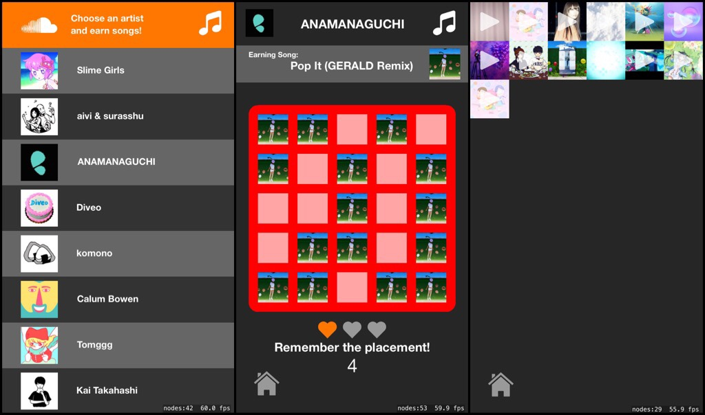

# Memory Game

- The user selects an artist on the home screen that they are interested in and a memory matrix made using that artist's track artwork appears. 
- After playing three rounds of the game accurately, the user earns that track and can stream it from the music note panel. 
- The difficulty increases with each round so that it isn’t as easy to earn songs in time

